# Transactional & Fault-Tolerant CQRS

This document provides a comprehensive technical guide on the **pure SQL-based Transactional CQRS** architecture implemented within `watermill-cqrs-fx`.

---

## Architectural Goal

The core objective is to achieve high resilience and absolute consistency. Every execution cycle must guarantee that:

1. A pending command is fetched from the queue and locked.
2. The domain handler is executed (changing aggregate/business state in the DB).
3. Any generated events are stored in the outbox table.
4. The execution status is updated to success.

**All of these actions must happen within a single database transaction.** If any step fails, all mutations (including the outbox events and command status changes) are completely rolled back to avoid partial state corruption.

---

## Sequence Diagram

The following sequence diagram outlines the entire flow across the Command Bus, database queues, domain handlers, Outbox, and local event dispatch channels:

```mermaid
sequenceDiagram
    autonumber
    actor Client as HTTP Client
    participant Bus as Command Bus (Wrapper)
    participant CQueue as DB: command_executions
    participant Worker as SQLCommandQueueWorker
    participant Handler as Domain CommandHandler
    participant EBus as Event Bus (Wrapper)
    participant OutboxTable as DB: events (Outbox)
    participant OWorker as SQLOutboxWorker
    participant GoChan as GoChannel (In-Memory Bus)
    participant EProc as Watermill EventProcessor
    participant EHandler as Event Handler (e.g., Read Models)

    %% PHASE 1: Command Enqueueing
    Note over Client, CQueue: Phase 1: Command Enqueueing
    Client->>Bus: Send(Command)
    Bus->>Bus: Generate Command ID & Serialize Payload
    Bus->>CQueue: Insert command (status='pending')
    CQueue-->>Bus: Persistent OK
    Bus-->>Client: Return Command ID

    %% PHASE 2: Background Command Execution
    Note over Worker, OutboxTable: Phase 2: Transactional Command Execution (Single DB Transaction)
    loop Every 100ms
        Worker->>CQueue: GetNextPending() [FOR UPDATE SKIP LOCKED]
        CQueue-->>Worker: Return Locked Command Record
    end
    
    rect rgb(30, 41, 59)
        Note right of Worker: Start DB Transaction (Atomic Block)
        Worker->>CQueue: Update status to 'started'
        Worker->>Handler: Handle(ctx, tx, Command)
        
        Handler->>Handler: Mutate aggregate states / records using tx
        
        Handler->>EBus: Publish(ctx, tx, Events)
        Note over EBus, OutboxTable: Since tx != nil, events go to DB Outbox
        EBus->>OutboxTable: Insert events inside same tx
        OutboxTable-->>EBus: Saved inside tx
        
        Worker->>CQueue: Update status to 'success'
        Note right of Worker: Commit DB Transaction
    end

    %% PHASE 3: Outbox Event Publishing & Consumption
    Note over OWorker, EHandler: Phase 3: Asynchronous Event Dispatching
    loop Every 100ms
        OWorker->>OutboxTable: Scan unpublished events (limit 50)
        OutboxTable-->>OWorker: Return events list
    end
    
    loop For each event
        OWorker->>GoChan: Publish(Topic, Message)
        GoChan-->>OWorker: Acknowledge publication
        
        OWorker->>OutboxTable: Delete event by ID
        OutboxTable-->>OWorker: Deleted
    end
    
    GoChan->>EProc: Deliver event message
    EProc->>EHandler: Handle(Event)
    EHandler->>EHandler: Update Read Models / projection database
```



---

## Detailed Execution Sequence

### Phase 1: Command Enqueueing

1. The client dispatches a command through the `CommandBus`.
2. When `UseSQLQueue` is set to `true`, the `CommandBus` serializes the command into JSON and writes it into the `command_executions` table with the state `'pending'`.
3. The method returns immediately, and the caller receives the `CommandID`.

### Phase 2: Transactional Command Processing

1. A background **`SQLCommandQueueWorker`** polls the `command_executions` table.
2. It selects and locks a single pending record utilizing:
   - `SELECT ... FOR UPDATE SKIP LOCKED` for MySQL/PostgreSQL.
   - Database engine level serialization for SQLite.
3. The worker starts a transaction `tx` via `TransactionManager`.
4. Inside this `tx`:
   - It changes the command state in the database to `'started'`.
   - It invokes the domain **`CommandHandler`**, passing the active `tx`.
   - The handler edits domain business tables using `tx`.
   - The handler publishes events by calling `EventBus.Publish(ctx, tx, events...)`.
   - Because `tx` is not `nil`, the events are directly inserted into the `events` table (Outbox) as part of the *same* database transaction.
   - The command status is updated to `'success'`.
5. The transaction commits.
6. **Fault Tolerance**: If any error is returned by the handler, the transaction is **rolled back**. The aggregates remain untouched, and no events are queued in the outbox. The worker catches this rollback and, in a separate short database session, records the `'failed'` status alongside the error JSON payload for tracing.

### Phase 3: Asynchronous Event Dispatching (Outbox Worker)

1. The background **`SQLOutboxWorker`** monitors the `events` table.
2. It reads unpublished events (e.g. in batches of 50) and publishes them to the Watermill `message.Publisher` (the local `GoChannel` bus).
3. Once the bus acknowledges delivery, the worker **deletes** the event row from the `events` table.
4. **At-Least-Once Delivery**: If the worker crashes mid-process, the event remains in the database and is processed again when the worker restarts.
5. The Watermill `EventProcessor` receives the event and routes it to the local **`Event Handlers`** (e.g., to build Read Models).

---

## Setup & Integration

### 1. Database Schema

Ensure the `command_executions` and `events` (Outbox) tables have the required columns:

```sql
-- Command Executions Queue
CREATE TABLE command_executions (
    id VARCHAR(255) PRIMARY KEY,
    handler_name VARCHAR(255) NOT NULL,
    status VARCHAR(50) NOT NULL,
    error_payload TEXT,
    command_name VARCHAR(255) DEFAULT '',
    payload LONGBLOB,
    started_at TIMESTAMP NULL,
    finished_at TIMESTAMP NULL
);

-- Outbox Events
CREATE TABLE events (
    id VARCHAR(255) PRIMARY KEY,
    topic VARCHAR(255) NOT NULL,
    payload LONGBLOB NOT NULL,
    metadata TEXT NOT NULL,
    occurred_at TIMESTAMP NOT NULL
);
```

### 2. Configuration

Register the providers in your Uber.fx module:

```go
fx.Provide(
    // Outbox integration
    func(db *sql.DB) wcqrs.Outbox {
        return wcqrs.NewSQLOutbox(db, "events")
    },
    // Transaction Manager
    func(db *sql.DB) wcqrs.TransactionManager {
        return wcqrs.NewSQLTransactionManager(db)
    },
    // Command Exec Store
    func(db *sql.DB) wcqrs.CommandExecutionStore {
        dialect := wcqrs.DialectSQLite
        if os.Getenv("DB_DRIVER") == "mysql" {
            dialect = wcqrs.DialectMySQL
        }
        return wcqrs.NewSQLCommandExecutionStore(db, "command_executions", dialect)
    },
    // SQL Queue settings
    func() wcqrs.CommandBusConfig {
        return wcqrs.CommandBusConfig{
            UseSQLQueue:        true,
            WaitTimeout:        5 * time.Second,
            WaitTickerInterval: 100 * time.Millisecond,
        }
    },
)
```
