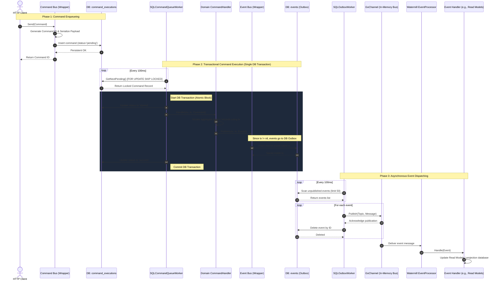

# Transactional & Fault-Tolerant CQRS

This document provides a comprehensive technical guide on the **pure SQL-based Transactional CQRS** architecture implemented within `watermill-cqrs-fx`.

---

## Architectural Goal

The core objective is to achieve high resilience and absolute consistency. Every execution cycle must guarantee that:

1. A pending command is fetched from the queue and locked.
2. The domain handler is executed (changing aggregate/business state in the DB).
3. Any generated events are stored in the outbox table.
4. The execution status is updated to success.

**All of these actions must happen within a single database transaction.** If any step fails, all mutations (including the outbox events and command status changes) are completely rolled back to avoid partial state corruption.

---

## Sequence Diagram

The following sequence diagram outlines the entire flow across the Command Bus, database queues, domain handlers, Outbox, and local event dispatch channels:


```mermaid
sequenceDiagram
    autonumber
    actor Client as HTTP Client
    participant Bus as Command Bus (Wrapper)
    participant CQueue as DB: command_executions
    participant Worker as SQLCommandQueueWorker
    participant Handler as Domain CommandHandler
    participant EBus as Event Bus (Wrapper)
    participant OutboxTable as DB: events (Outbox)
    participant OWorker as SQLOutboxWorker
    participant GoChan as GoChannel (In-Memory Bus)
    participant EProc as Watermill EventProcessor
    participant EHandler as Event Handler (e.g., Read Models)

    %% PHASE 1: Command Enqueueing
    Note over Client, CQueue: Phase 1: Command Enqueueing
    Client->>Bus: Send(Command)
    Bus->>Bus: Generate Command ID & Serialize Payload
    Bus->>CQueue: Insert command (status='pending')
    CQueue-->>Bus: Persistent OK
    Bus-->>Client: Return Command ID

    %% PHASE 2: Background Command Execution
    Note over Worker, OutboxTable: Phase 2: Transactional Command Execution (Single DB Transaction)
    loop Every 100ms
        Worker->>CQueue: GetNextPending() [FOR UPDATE SKIP LOCKED]
        CQueue-->>Worker: Return Locked Command Record
    end
    
    rect rgb(30, 41, 59)
        Note right of Worker: Start DB Transaction (Atomic Block)
        Worker->>CQueue: Update status to 'started'
        Worker->>Handler: Handle(ctx, tx, Command)
        
        Handler->>Handler: Mutate aggregate states / records using tx
        
        Handler->>EBus: Publish(ctx, tx, Events)
        Note over EBus, OutboxTable: Since tx != nil, events go to DB Outbox
        EBus->>OutboxTable: Insert events inside same tx
        OutboxTable-->>EBus: Saved inside tx
        
        Worker->>CQueue: Update status to 'success'
        Note right of Worker: Commit DB Transaction
    end

    %% PHASE 3: Outbox Event Publishing & Consumption
    Note over OWorker, EHandler: Phase 3: Asynchronous Event Dispatching
    loop Every 100ms
        OWorker->>OutboxTable: Scan unpublished events (limit 50)
        OutboxTable-->>OWorker: Return events list
    end
    
    loop For each event
        OWorker->>GoChan: Publish(Topic, Message)
        GoChan-->>OWorker: Acknowledge publication
        
        OWorker->>OutboxTable: Delete event by ID
        OutboxTable-->>OWorker: Deleted
    end
    
    GoChan->>EProc: Deliver event message
    EProc->>EHandler: Handle(Event)
    EHandler->>EHandler: Update Read Models / projection database
```

---

## Detailed Execution Sequence

### Phase 1: Command Enqueueing

1. The client dispatches a command through the `CommandBus`.
2. When `UseSQLQueue` is set to `true`, the `CommandBus` serializes the command into JSON and writes it into the `command_executions` table with the state `'pending'`.
3. The method returns immediately, and the caller receives the `CommandID`.

### Phase 2: Transactional Command Processing

1. A background **`SQLCommandQueueWorker`** polls the `command_executions` table.
2. It selects and locks a single pending record utilizing:
   - `SELECT ... FOR UPDATE SKIP LOCKED` for MySQL/PostgreSQL.
   - Database engine level serialization for SQLite.
3. The worker starts a transaction `tx` via `TransactionManager`.
4. Inside this `tx`:
   - It changes the command state in the database to `'started'`.
   - It invokes the domain **`CommandHandler`**, passing the active `tx`.
   - The handler edits domain business tables using `tx`.
   - The handler publishes events by calling `EventBus.Publish(ctx, tx, events...)`.
   - Because `tx` is not `nil`, the events are directly inserted into the `events` table (Outbox) as part of the *same* database transaction.
   - The command status is updated to `'success'`.
5. The transaction commits.
6. **Fault Tolerance**: If any error is returned by the handler, the transaction is **rolled back**. The aggregates remain untouched, and no events are queued in the outbox. The worker catches this rollback and, in a separate short database session, records the `'failed'` status alongside the error JSON payload for tracing.

### Phase 3: Asynchronous Event Dispatching (Outbox Worker)

1. The background **`SQLOutboxWorker`** monitors the `events` table.
2. It reads unpublished events (e.g. in batches of 50) and publishes them to the Watermill `message.Publisher` (the local `GoChannel` bus).
3. Once the bus acknowledges delivery, the worker **deletes** the event row from the `events` table.
4. **At-Least-Once Delivery**: If the worker crashes mid-process, the event remains in the database and is processed again when the worker restarts.
5. The Watermill `EventProcessor` receives the event and routes it to the local **`Event Handlers`** (e.g., to build Read Models).

---

## Setup & Integration

### 1. Database Schema

Ensure the `command_executions` and `events` (Outbox) tables have the required columns:

```sql
-- Command Executions Queue
CREATE TABLE command_executions (
    command_id VARCHAR(255) PRIMARY KEY,
    handler_name VARCHAR(255) NOT NULL DEFAULT '',
    command_name VARCHAR(255) NOT NULL DEFAULT '',
    payload LONGBLOB,
    status VARCHAR(32) NOT NULL DEFAULT 'pending',
    error_data LONGBLOB,
    started_at DATETIME NOT NULL,
    finished_at DATETIME,
    INDEX idx_status_started_at (status, started_at)
);

-- Outbox Events
CREATE TABLE events (
    id VARCHAR(255) PRIMARY KEY,
    topic VARCHAR(255) NOT NULL,
    payload LONGBLOB NOT NULL,
    metadata TEXT NOT NULL,
    occurred_at DATETIME NOT NULL
);
```

> **Recommendation**: Always include `INDEX (status, started_at)` on `command_executions` for high-throughput `GetNextPending` queries (`SKIP LOCKED`) and fast `COUNT(*)` pending checks.

### 2. Hybrid In-Process Wake-Up & Worker Configuration

Instead of aggressive constant database polling (10-20 queries/s at idle), workers use an **in-process wake-up signal** (`Notifier`) combined with a relaxed fallback polling interval (default 30s) for recovery and cross-instance safety:

- **Command Queue**: `CommandBus.Send()` records the command to SQL and immediately calls `Notifier.Notify()`, waking the worker with sub-millisecond latency.
- **Outbox Worker**: `SQLCommandQueueWorker` wakes `outboxNotifier` after committing a command transaction. For external transactions, `EventBus.Publish` registers an after-commit hook with `TransactionManager` that fires upon successful commit.
- **Backpressure**: When `pending` commands exceed `MaxPending` (default 1000), `Send()` immediately returns `ErrQueueFull` (`errors.Is`-compatible), allowing handlers or HTTP servers to respond with `503 Service Unavailable / Retry-After`.
- **Worker Drain Loop**: When triggered, workers drain in a loop until the queue/batch is empty before sleeping again.
- **Error Backoff**: When database queries fail, workers pause for `ErrorBackoff` (default 1s) to prevent hot-loop CPU burns.

#### `SQLQueueConfig` (Command Bus & Worker)

| Parameter | Type | Default | Description |
| --- | --- | --- | --- |
| `PollInterval` | `time.Duration` | `30s` | Fallback polling interval. `0` → default (`30s`), `<0` → disabled (wake-up only). |
| `Notifier` | `Notifier` | `nil` | Source of wake-up signals. In Fx mode, auto-wired from `Module`. In `NewCommandBus`, auto-created if nil and wake-up enabled. |
| `DisableWakeup` | `bool` | `false` | When true, disables wake-up signaling (pure polling mode). |
| `Concurrency` | `int` | `1` | Worker goroutines count (uses `SKIP LOCKED` on MySQL; forced to `1` on SQLite). |
| `MaxPending` | `int` | `1000` | Backpressure limit. Returns `ErrQueueFull` if reached. `0` → default (`1000`), `<0` → no limit. Requires `PendingCounter`. |
| `PendingCountCacheTTL` | `time.Duration` | `1s` | In-memory TTL for caching `COUNT(*)` pending. `<0` → disabled. |
| `ErrorBackoff` | `time.Duration` | `1s` | Pause after database errors to avoid hot-looping. `<0` → disabled. |

#### `SQLOutboxWorkerConfig` (Outbox Worker)

| Parameter | Type | Default | Description |
| --- | --- | --- | --- |
| `TableName` | `string` | `"events"` | Outbox table name. Can also be inferred from `SQLOutbox.TableName()`. |
| `PollInterval` | `time.Duration` | `30s` | Fallback polling interval. `0` → default (`30s`), `<0` → disabled. |
| `BatchSize` | `int` | `50` | Batch size limit for polling/draining events. |
| `Notifier` | `Notifier` | `nil` | Independent wake-up notifier instance for outbox. In Fx mode, auto-wired via `name:"outbox_notifier"`. |
| `ErrorBackoff` | `time.Duration` | `1s` | Pause after database errors. `<0` → disabled. |

### 3. Optional Interfaces & Backward Compatibility

To preserve backward compatibility and avoid forcing third-party mocks or stores to implement new methods:

- **`PendingCounter`**:

  ```go
  type PendingCounter interface {
      CountPending(ctx context.Context, tx Tx) (int, error)
  }
  ```

  Implemented by `SQLCommandExecutionStore`. If a custom `CommandExecutionStore` does not implement `PendingCounter`, the `MaxPending` queue capacity check is gracefully bypassed without errors.

- **`AfterCommitter`**:

  ```go
  type AfterCommitter interface {
      AfterCommit(ctx context.Context, fn func()) bool
  }
  ```

  Implemented by `SQLTransactionManager`. If a transaction manager does not implement `AfterCommitter`, `EventBus.Publish` attempts `RegisterAfterCommit(ctx, ...)`, and falls back to immediate notification if the transaction was opened outside `WithinTransaction`.

- **`NotifierProvider`**:

  ```go
  type NotifierProvider interface {
      Notifier() Notifier
  }
  ```

  Implemented by `CommandBus`, `SQLCommandQueueWorker`, and `SQLOutboxWorker`, allowing components to expose their configured `Notifier`.

- **`SQLQueueConfigProvider`**:

  ```go
  type SQLQueueConfigProvider interface {
      SQLQueueConfig() SQLQueueConfig
  }
  ```

  Implemented by `CommandBus`, allowing workers to reuse the complete `SQLQueueConfig` (concurrency, poll interval, backoff, and notifier) configured on the bus.

### 4. Manual Assembly (Without Uber.fx)

When assembling components manually without Uber.fx, the wake-up notifier must be shared between the bus and the worker so that dispatches wake the worker immediately:

#### Option A: Using `NewSQLCommandQueueWorkerWithBus` (Recommended)

`NewCommandBus` automatically initializes an in-process `Notifier` if one is not provided. `NewSQLCommandQueueWorkerWithBus` reuses the bus's full `SQLQueueConfig` (including `Notifier`, `Concurrency`, `PollInterval`, etc.) and accepts an optional `outboxNotifier`:

```go
// 1. Create CommandBus (automatically initializes its own Notifier and SQLQueueConfig)
bus := wcqrs.NewCommandBus(watermillCmdBus, execStore, marshaler, wcqrs.CommandBusConfig{
    UseSQLQueue: true,
})

// 2. Create worker wired to the bus config and outbox notifier
worker, err := wcqrs.NewSQLCommandQueueWorkerWithBus(
    execStore,
    txManager,
    marshaler,
    logger,
    handlers,
    bus,            // Reuses bus SQLQueueConfig & Notifier
    outboxNotifier, // Wakes outbox worker upon command transaction commit
)
```

#### Option B: Sharing an Explicit `Notifier`

Alternatively, you can instantiate `NewChannelNotifier()` yourself and pass it to both components:

```go
// Shared notifiers
cmdNotifier := wcqrs.NewChannelNotifier()
outboxNotifier := wcqrs.NewChannelNotifier()

// Command Bus
bus := wcqrs.NewCommandBus(watermillCmdBus, execStore, marshaler, wcqrs.CommandBusConfig{
    UseSQLQueue: true,
    SQLQueue: wcqrs.SQLQueueConfig{
        Notifier: cmdNotifier,
    },
})

// Command Queue Worker
queueWorker, err := wcqrs.NewSQLCommandQueueWorkerWithConfig(
    execStore,
    txManager,
    marshaler,
    logger,
    handlers,
    wcqrs.SQLQueueConfig{
        Notifier: cmdNotifier,
    },
    outboxNotifier, // Wakes outbox worker upon command transaction commit
)

// Event Bus (Outbox)
eventBus := wcqrs.NewEventBusWithConfig(watermillEventBus, marshaler, outbox, wcqrs.EventBusConfig{
    TxManager:      txManager,
    OutboxNotifier: outboxNotifier,
})

// Outbox Worker
outboxWorker := wcqrs.NewSQLOutboxWorkerWithConfig(db, publisher, logger, wcqrs.SQLOutboxWorkerConfig{
    Notifier: outboxNotifier,
})
```

> **Note**: If a worker is instantiated without a `Notifier` (e.g. `SQLQueueConfig{}`), it will log a notice at startup and operate in fallback polling mode (every 30s) without wake-up signals.

### 5. Configuration with Uber.fx

When using Uber.fx, `wcqrs.Module` automatically provides named notifiers (`"command_notifier"` and `"outbox_notifier"`), wires them between the buses and workers, and respects any custom overrides passed via `CommandBusConfig.SQLQueue.Notifier` or `SQLOutboxWorkerConfig.Notifier`:

```go
fx.Provide(
    // Outbox integration
    func(db *sql.DB) wcqrs.Outbox {
        return wcqrs.NewSQLOutbox(db, "events")
    },
    // Transaction Manager
    func(db *sql.DB) wcqrs.TransactionManager {
        return wcqrs.NewSQLTransactionManager(db)
    },
    // Command Execution Store
    func(db *sql.DB) wcqrs.CommandExecutionStore {
        dialect := wcqrs.DialectSQLite
        if os.Getenv("DB_DRIVER") == "mysql" {
            dialect = wcqrs.DialectMySQL
        }
        return wcqrs.NewSQLCommandExecutionStore(db, "command_executions", dialect)
    },
    // Command Bus & Queue Settings
    func() wcqrs.CommandBusConfig {
        return wcqrs.CommandBusConfig{
            UseSQLQueue:        true,
            WaitTimeout:        5 * time.Second,
            WaitTickerInterval: 100 * time.Millisecond,
            SQLQueue: wcqrs.SQLQueueConfig{
                PollInterval: 30 * time.Second,
                Concurrency:  1,
                MaxPending:   1000,
            },
        }
    },
    // Optional custom Outbox Worker settings
    func() wcqrs.SQLOutboxWorkerConfig {
        return wcqrs.SQLOutboxWorkerConfig{
            TableName:    "events",
            PollInterval: 30 * time.Second,
            BatchSize:    50,
        }
    },
)
```
